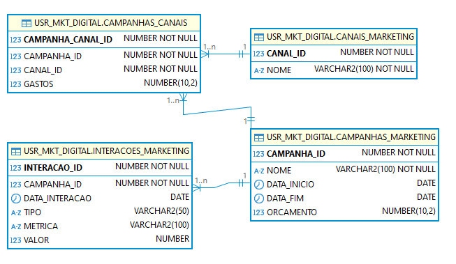

# Banco de Dados - Sistema de Marketing Digital

## Descrição
Projeto de banco de dados usado para armazenar informações sobre campanhas de marketing simulando uma utilização real.

## Modelo Físico


## Estrutura do Banco de dados
### Tabela: CANAIS_MARKETING
- CANAL_ID: O identificador do canal
- NOME: A descrição do canal utilizado para o marketing

### Tabela: CAMPANHAS_MARKETING
- CAMPANHA_ID: O identificador da campanha
- NOME: O título utilizado para representar uma campanha publicitária realizada pela empresa
- DATA_INICIO: Quando começou a campanha
- DATA_FIM: Quando terminou a campanha
- ORCAMENTO: Quanto custou a campanha

### Tabela: INTERACOES_MARKETING
- INTERACAO_ID: O identificador das interações
- CAMPANHA_ID: O identificador das campanhas
- DATA_INTERACAO: Quando ocorreu a interação
- TIPO: Tipo de interação (ex: Clique, Visualização).
- METRICA: Métrica relacionada à interação (ex: CTR, Impressões).
- VALOR: Valor da métrica

### Tabela: CAMPANHAS_CANAIS
- CAMPANHA_CANAL_ID: O identificador da tabela
- CAMPANHA_ID: O identificador da campanha
- CANAL_ID: O identificador do canal
- GASTOS: O total de gastos na campanha


## Pré-requisitos:
- Oracle SQL Developer instalado e configurado.

## Como executar
- Clone o repositório
```bash
    git clone https://github.com/MicheleMelo0/bd-gestao-marketing.git
```

- Importe os scripts para o SQL Developer

- Comece a execução pelo script "estrutura.sql" (localizado na pasta DDL) para criar as tabelas do banco. Clique no botão de executar 

- Após isso, repita o passo de execução, mas dessa vez com o script "dados.sql" (pasta DML) para popular as tabelas.

- Pronto! 